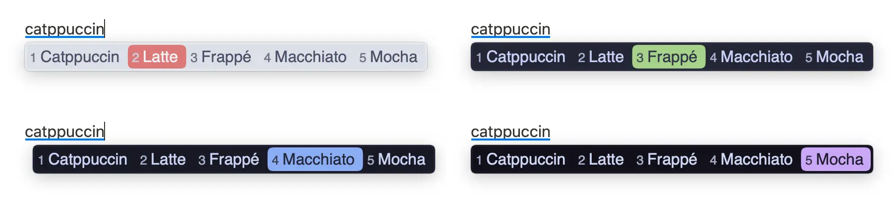
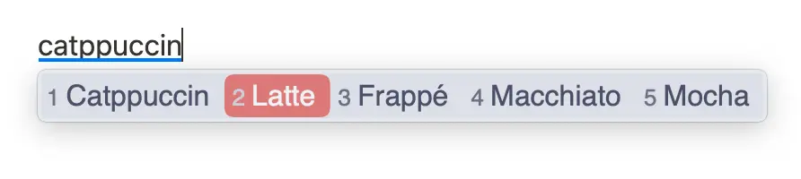
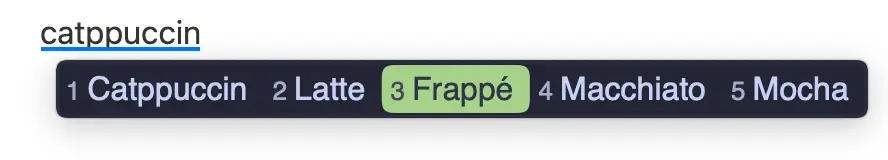
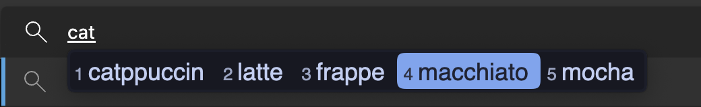
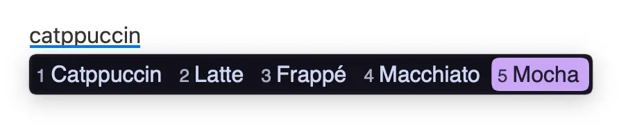

<h3 align="center">
	<br/>
	
	Catppuccin for <a href="https://github.com/rime/squirrel">Squirrel(Rime for MacOS)</a>
	
</h3>

<p align="center">
	<a href="https://github.com/moseeking/squirrel/stargazers"></a>
	<a href="https://github.com/moseeking/squirrel/issues"></a>
	<a href="https://github.com/moseeking/squirrel/contributors"></a>
</p>

<p align="center">
	
</p>

## Previews

<details>
<summary>🌻 Latte</summary>

</details>
<details>
<summary>🪴 Frappé</summary>

</details>
<details>
<summary>🌺 Macchiato</summary>

</details>
<details>
<summary>🌿 Mocha</summary>

</details>

## Usage

### English
1. Download `squirrel.custom.yaml` file [here](/squirrel.custom.yaml).
2. Open the `Squirrel` configuration folder through the `Settings...` menu item in the `Squirrel` menu bar.
3. Backup the `squirrel.custom.yaml` file in the configuration folder,replace it with the `squirrel.custom.yaml` file downloaded in step one.
> Instead: open the `squirrel.custom.yaml` file under the configuration folder, copy the content after the `preset_color_schemes` tag from the downloaded file in step one into the configuration, and modify the content of the `style/color_scheme` and `style/color_scheme_dark` tags to your preferred theme. This ensures that the original configuration content is preserved to the greatest extent possible. For specific parameters, please refer to the FAQ.  
4. Make the configuration effective through the `Deploy` menu item in the `Squirrel` menu bar (default shortcut: control+option+\`).
5. Well done,Enjoy~

### 中文
1. 在[这里](/squirrel.custom.yaml)下载`squirrel.custom.yaml`文件。
2. 通过`鼠须管`软件菜单栏`用户设置...`菜单项进入配置文件夹。
3. 备份配置文件夹下面的`squirrel.custom.yaml`文件,替换成第一步下载的`squirrel.custom.yaml`文件。
> 或者打开配置文件夹下面的`squirrel.custom.yaml`文件,将第一步下载的文件`preset_color_schemes`标签后的内容复制进入配置中，修改`style/color_scheme`和`style/color_scheme_dark`标签的内容为喜欢的主题，这样可以保证原来的配置内容最大程度上保存，参数具体参考FAQ。
4. 通过`鼠须管`软件菜单栏`重新部署`菜单项生效配置（默认快捷键:control+option+\`）
5. 完成~

<!-- this section is optional -->
## 🙋 FAQ

### English

#### How to customize the related color theme?
The following are some custom theme parameters within the file `squirrel.custom.yaml`：
```
  style/color_scheme: catppuccin_latte         # for MacOS Light Appearance
  style/color_scheme_dark: catppuccin_mocha    # for MacOS Dark Appearance
```
Here are some color parameters for custom themes(`#aabbggrr`)：
``` 
  back_color: 0xFFFFFF                         # Candidate bar background color
  border_color: 0xFFFFFF                       # Border color
  text_color: 0xFFFFFF                         # Pinyin line text color 
  label_color: 0xFFFFFF                        # Candidate bar number color
  candidate_text_color: 0xFFFFFF               # Candidate item text color
  hilited_back_color: 0xFFFFFF                 # Background color of the first candidate item
  hilited_candidate_text_color: 0xFFFFFF       # Text color of the first candidate item
  hilited_candidate_label_color: 0xFFFFFF      # Number color of the first candidate item
  hilited_text_color: 0xFFFFFF                 # Highlighted Pinyin (requires embedded coding)
  hilited_comment_text_color: 0xFFFFFF         # Highlighted annotation text color
  comment_text_color: 0xFFFFFF                 # Pinyin and other prompt text color
```
> Tip:the color format for Squirrel is `#aabbggrr`. If using a different color format, please make sure to replace accordingly.

#### Can this configuration be adapted to other platforms of Rime input method? 
> As for other Rime input methods on different platforms, such as [Weasel](https://github.com/rime/weasel), they should be compatible according to Rime's instructions. You just need to rename the configuration file to the `<configuration code>.custom.yaml`,this project has not undergone relevant testing. Please refer to the [Rime official documentation](https://github.com/rime/home/wiki ) for details.


### 中文

#### 如何自定义相关颜色主题?
以下是文件`squirrel.custom.yaml`内自定义的一些主题参数：
```
  style/color_scheme: catppuccin_latte         # macos明亮主题
  style/color_scheme_dark: catppuccin_mocha    # macos黑暗主题
```
以下是自定义主题的一些颜色参数(`#aabbggrr`)：
```
  back_color: 0xFFFFFF                         # 候选条背景色
  border_color: 0xFFFFFF                       # 边框色
  text_color: 0xFFFFFF                         # 拼音行文字颜色
  label_color: 0xFFFFFF                        # 预选栏编号颜色
  candidate_text_color: 0xFFFFFF               # 预选项文字颜色
  hilited_back_color: 0xFFFFFF                 # 第一候选项背景背景色
  hilited_candidate_text_color: 0xFFFFFF       # 第一候选项文字颜色
  hilited_candidate_label_color: 0xFFFFFF      # 第一候选项编号颜色
  hilited_text_color: 0xFFFFFF                 # 高亮拼音 (需要开启内嵌编码)
  hilited_comment_text_color: 0xFFFFFF         # 注解文字高亮
  comment_text_color: 0xFFFFFF                 # 拼音等提示文字颜色
```
> 注意：鼠须管配置文件均使用 `#aabbggrr` 的颜色模式，如果使用不同颜色的格式配置时注意转换。
#### 其他平台的Rime输入法能否适配？
> 其他平台的Rime输入法如：[小狼毫](https://github.com/rime/weasel)等，按照Rime的相关说明应该是互相通用的，只需将配置文件名称修改为相应的`<配置代号>.custom.yaml`即可，对此本项目未经过相关测试。具体参考 [Rime官方文档](https://github.com/rime/home/wiki)。


	

## 💝 Thanks to

- [moseeking](https://github.com/moseeking)

&nbsp;

<p align="center">
	
</p>

<p align="center">
	Copyright &copy; 2021-present <a href="https://github.com/catppuccin" target="_blank">Catppuccin Org</a>
</p>

<p align="center">
	<a href="https://github.com/catppuccin/catppuccin/blob/main/LICENSE"></a>
</p>
