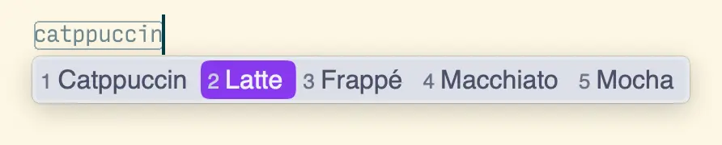
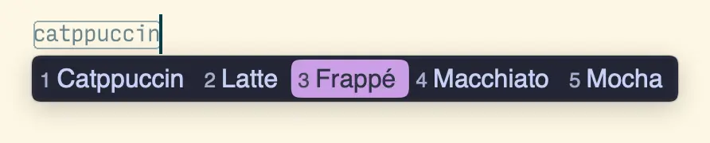
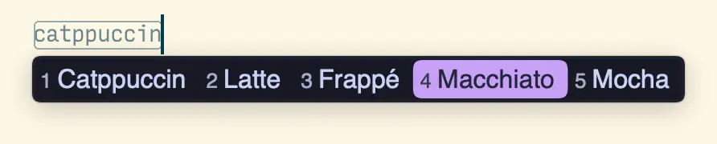

<h3 align="center">
	<br/>
	
	Catppuccin for <a href="https://github.com/rime/squirrel">Squirrel</a>
	
</h3>

<p align="center">
	<a href="https://github.com/moseeking/squirrel/stargazers"></a>
	<a href="https://github.com/moseeking/squirrel/issues"></a>
	<a href="https://github.com/moseeking/squirrel/contributors"></a>
</p>

<p align="center">
	
</p>

## Previews

<details>
<summary>🌻 Latte</summary>

</details>
<details>
<summary>🪴 Frappé</summary>

</details>
<details>
<summary>🌺 Macchiato</summary>

</details>
<details>
<summary>🌿 Mocha</summary>

</details>

## Usage

### English
1. Download `squirrel.custom.yaml` file [here](/squirrel.custom.yaml).
2. Open the `Squirrel` configuration folder through the `Settings...` menu item in the `Squirrel` menu bar.
3. Backup the `squirrel.custom.yaml` file in the configuration folder,  replace it with the `squirrel.custom.yaml` file downloaded in step one.
4. Make the configuration effective through the `Deploy` menu item in the `Squirrel` menu bar (default shortcut: control+option+\`).
5. Well done,Enjoy~

### 中文
1. 在[这里](/squirrel.custom.yaml)下载`squirrel.custom.yaml`文件。
2. 通过“鼠须管”软件菜单栏“用户设置...”菜单项进入配置文件夹。
3. 备份配置文件夹下面的`squirrel.custom.yaml`文件,替换成第一步下载的`squirrel.custom.yaml`文件。
4. 通过“鼠须管”软件菜单栏“重新部署”菜单项生效配置（默认快捷键:control+option+\`）
5. 完成~

<!-- this section is optional -->
## 🙋 FAQ

### English

#### How to customize the related color theme?:
The following are some custom theme parameters within the file `squirrel.custom.yaml`：
```
  style/color_scheme: catppuccin_latte         # for MacOS Light Appearance
  style/color_scheme_dark: catppuccin_mocha    # for MacOS Dark Appearance
```
Here are some color parameters for custom themes(`#aabbggrr`)：
``` 
  back_color: 0xFFFFFF                         # Candidate bar background color
  border_color: 0xFFFFFF                       # Border color
  text_color: 0xFFFFFF                         # Pinyin line text color
  label_color: 0xFFFFFF                        # Candidate bar number color
  candidate_text_color: 0xFFFFFF               # Candidate item text color
  hilited_back_color: 0xFFFFFF                 # Background color of the first candidate item
  hilited_candidate_text_color: 0xFFFFFF       # Text color of the first candidate item
  hilited_candidate_label_color: 0xFFFFFF      # Number color of the first candidate item
  hilited_text_color: 0xFFFFFF                 # Highlighted Pinyin (requires embedded coding)
  hilited_comment_text_color: 0xFFFFFF         # Highlighted annotation text color
  comment_text_color: 0xFFFFFF                 # Pinyin and other prompt text color
```
> Tip:the color format for Squirrel is `#aabbggrr`. If using a different color format, please make sure to replace accordingly.

#### Can this configuration be adapted to other platforms of Rime input method? 
> As for other Rime input methods on different platforms, such as [Weasel](https://github.com/rime/weasel) and [ibus-rime](https://github.com/rime/ibus-rime), they should be compatible according to Rime's instructions. You just need to rename the configuration file to the `<configuration code>.custom.yaml`,this project has not undergone relevant testing. Please refer to the [Rime official documentation](https://github.com/rime/home/wiki ) for details.


### 中文

#### 如何自定义相关颜色主题:
以下是文件`squirrel.custom.yaml`内自定义的一些主题参数：
```
  style/color_scheme: catppuccin_latte         # macos明亮主题
  style/color_scheme_dark: catppuccin_mocha    # macos黑暗主题
```
以下是自定义主题的一些颜色参数(`#aabbggrr`)：
```
  back_color: 0xE8E0DC                         # 候选条背景色
  border_color: 0xEFE9E6                       # 边框色
  text_color: 0x775F5C                         # 拼音行文字颜色
  label_color: 0x856F6C                        # 预选栏编号颜色
  candidate_text_color: 0x694F4C               # 预选项文字颜色
  hilited_back_color: 0x7878DD                 # 第一候选项背景背景色
  hilited_candidate_text_color: 0xF5F1EF       # 第一候选项文字颜色
  hilited_candidate_label_color: 0xDAD0CC      # 第一候选项编号颜色
  hilited_text_color: 0xBEB0AC                 # 高亮拼音 (需要开启内嵌编码)
  hilited_comment_text_color: 0xDAD0CC         # 注解文字高亮
  comment_text_color: 0xBEB0AC                 # 拼音等提示文字颜色
```
#### 其他平台的Rime输入法能否适配？
> 其他平台的Rime输入法如：[小狼毫](https://github.com/rime/weasel)、[ibus-rime](https://github.com/rime/ibus-rime)等，按照Rime的相关说明应该是互相通用的，只需将配置文件名称修改为相应的`<配置代号>.custom.yaml`即可，对此本项目未经过相关测试。具体参考 [Rime官方文档](https://github.com/rime/home/wiki )


	

## 💝 Thanks to

- [moseeking](https://github.com/moseeking)

&nbsp;

<p align="center">
	
</p>

<p align="center">
	Copyright &copy; 2021-present <a href="https://github.com/catppuccin" target="_blank">Catppuccin Org</a>
</p>

<p align="center">
	<a href="https://github.com/catppuccin/catppuccin/blob/main/LICENSE"></a>
</p>
