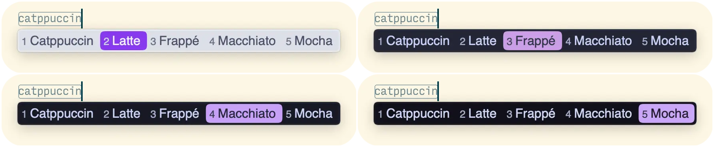
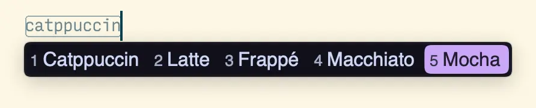

<h3 align="center">
	<br/>
	
	Catppuccin for <a href="https://github.com/rime/squirrel">Squirrel(Rime for MacOS)</a>
	
</h3>

<p align="center">
	<a href="https://github.com/moseeking/squirrel/stargazers"></a>
	<a href="https://github.com/moseeking/squirrel/issues"></a>
	<a href="https://github.com/moseeking/squirrel/contributors"></a>
</p>

<p align="center">
	
</p>

## 预览

<details>
<summary>🌻 Latte</summary>

</details>
<details>
<summary>🪴 Frappé</summary>

</details>
<details>
<summary>🌺 Macchiato</summary>

</details>
<details>
<summary>🌿 Mocha</summary>

</details>

&nbsp;
> 阅读其他语言版本: [English](./README.md),[简体中文](./README.zh-cn.md).

## 使用方法

1. 在[这里](./theme/squirrel.custom.yaml)下载`squirrel.custom.yaml`文件。
2. 通过`鼠须管`软件菜单栏`用户设置...`菜单项进入配置文件夹。
3. 备份配置文件夹下面的`squirrel.custom.yaml`文件,替换成第一步下载的`squirrel.custom.yaml`文件。
> 或者打开配置文件夹下面的`squirrel.custom.yaml`文件,将第一步下载的文件`preset_color_schemes`标签后的内容复制进入配置中，修改`style/color_scheme`和`style/color_scheme_dark`标签的内容为喜欢的主题，这样可以保证原来的配置内容最大程度上保存，参数具体参考FAQ。
4. 通过`鼠须管`软件菜单栏`重新部署`菜单项生效配置（默认快捷键:control+option+\`）
5. 完成~

<!-- this section is optional -->
## 🙋 常见问题

### 如何自定义相关颜色主题?
以下是文件`squirrel.custom.yaml`内自定义的一些主题参数：
```
  style/color_scheme: catppuccin_latte         # macos明亮主题
  style/color_scheme_dark: catppuccin_mocha    # macos黑暗主题
```
以下是自定义主题的一些颜色参数(`#aabbggrr`)：
```
  back_color: 0xFFFFFF                         # 候选条背景色
  border_color: 0xFFFFFF                       # 边框色
  text_color: 0xFFFFFF                         # 拼音行文字颜色
  label_color: 0xFFFFFF                        # 预选栏编号颜色
  candidate_text_color: 0xFFFFFF               # 预选项文字颜色
  hilited_back_color: 0xFFFFFF                 # 第一候选项背景背景色
  hilited_candidate_text_color: 0xFFFFFF       # 第一候选项文字颜色
  hilited_candidate_label_color: 0xFFFFFF      # 第一候选项编号颜色
  hilited_text_color: 0xFFFFFF                 # 高亮拼音 (需要开启内嵌编码)
  hilited_comment_text_color: 0xFFFFFF         # 注解文字高亮
  comment_text_color: 0xFFFFFF                 # 拼音等提示文字颜色
```
> 注意：鼠须管配置文件均使用 `#aabbggrr` 的颜色模式，如果使用不同颜色的格式配置时注意转换。
### 其他平台的Rime输入法能否适配？
> 其他平台的Rime输入法如：[小狼毫](https://github.com/rime/weasel)等，按照Rime的相关说明应该是互相通用的，只需将配置文件名称修改为相应的`<配置代号>.custom.yaml`即可，对此本项目未经过相关测试。具体参考 [Rime官方文档](https://github.com/rime/home/wiki)。


	

## 💝 致谢

- [moseeking](https://github.com/moseeking)

&nbsp;

<p align="center">
	
</p>

<p align="center">
	Copyright &copy; 2021-present <a href="https://github.com/catppuccin" target="_blank">Catppuccin Org</a>
</p>

<p align="center">
	<a href="https://github.com/catppuccin/catppuccin/blob/main/LICENSE"></a>
</p>
